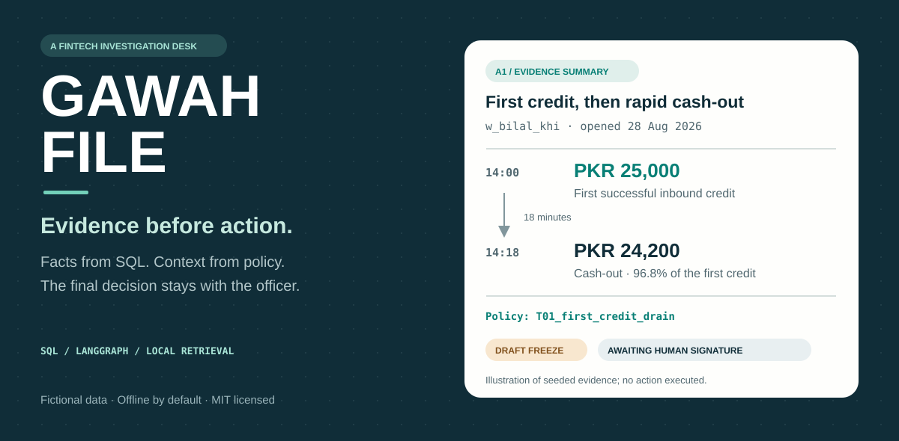
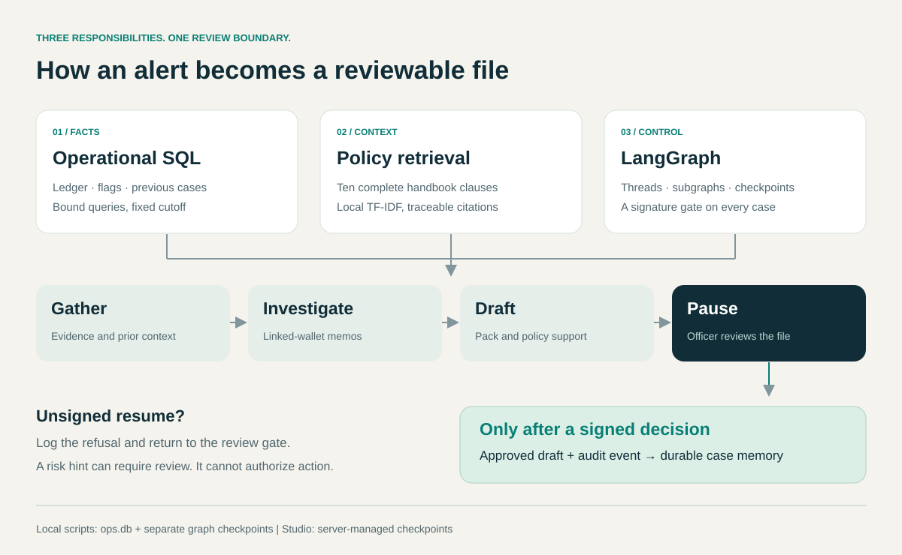

# Gawah File



**A human-reviewed investigation desk for digital-wallet alerts.**

[Start the demo](#run-it-locally) · [Explore the six cases](docs/CASE_STUDIES.md) · [Understand the architecture](docs/GUIDE.md) · [Browse the documentation](docs/README.md)

| Runtime | Evidence | Handbook | Control | License |
|---|---|---|---|---|
| Python 3.11+ | SQLite | Local TF-IDF retrieval | LangGraph | [MIT](LICENSE) |

## Why this project exists

A payment alert rarely tells an officer enough to make a decision. The officer still needs to reconstruct what moved, compare it with the customer's history, find the relevant policy, and explain why an action is justified. A fluent summary is only useful when those details can be checked.

Gawah File assembles that investigation file. It joins transaction evidence, handbook clauses, linked-wallet findings and previous case context into a structured pack. The workflow then stops. An officer reviews the evidence, chooses a decision and signs; only then is an approved draft recorded with an audit event.

*Gawah* means *witness*. The system prepares the evidence. The officer remains responsible for the decision.

> **Scope:** this repository uses fictional customer data and fictional handbook rules. It records approved drafts; it does not move money, issue refunds or change wallet status. No production wallet data was used.

## What you can demonstrate

| Capability | What a reviewer can inspect |
|---|---|
| Evidence grounded in SQL | Transaction ids, amounts, statuses and a fixed evidence cutoff |
| Policy with provenance | Retrieved clause ids, exact quotations and a SQL audit copy |
| Human control | A checkpoint before every approval; unsigned resumes are refused |
| Linked-wallet investigation | Two `Send` workers for A3, with their memos preserved in the saved pack |
| Customer context | Prior review and goodwill facts recovered across graph sessions |
| Restraint | A4 and A6 stay on a watch/close path instead of proposing a freeze |
| Repeatable execution | Synthetic seeds, deterministic templates and isolated acceptance tests |

The core demo runs without an API key. An optional model can help word the headline; evidence, policy rationale and action recommendations remain deterministic.

## Evidence changes the recommendation


The contrast between A1 and A4 is central to the project. Bilal's new wallet moves 96.8% of its first credit out after 18 minutes. Ayesha has established grocery and bill history and one unusual personal transfer, with no first-credit drain. Treating both cases alike would discard the very context an investigation is supposed to recover.

| Alert | Planted evidence | Fraud-desk draft | Read the file |
|---|---|---|---|
| **A1 · Bilal** | PKR 25,000 in, then PKR 24,200 out after 18 minutes | Freeze | [Evidence pack](docs/examples/A1.md) |
| **A2 · Imran** | Six failed night bills, followed by a PKR 18,000 cash-out | Watch | [Evidence pack](docs/examples/A2.md) |
| **A3 · Sara + Nadia** | PKR 9,500 and 9,800 sent to one new payee | Watch | [Evidence pack](docs/examples/A3.md) |
| **A4 · Ayesha** | Established spending history and one PKR 12,000 P2P send | Watch | [Evidence pack](docs/examples/A4.md) |
| **A5 · Hamza** | Active watchlist, closed prior review, PKR 400 grocery purchase | Close; retain flag | [Evidence pack](docs/examples/A5.md) |
| **A6 · Ayesha** | Two PKR 4,500 shop debits, 11 minutes apart; prior goodwill | Watch | [Evidence pack](docs/examples/A6.md) |

**Every file pauses before approval.** The care desk proposes watch on A1, and presents A6 in a [shorter prose format](docs/examples/A6-care.md). The [case studies](docs/CASE_STUDIES.md) explain the evidence, policy match, uncertainties and expected behavior for all six stories.

## How the pieces fit



1. **Load the case.** Read the alert, wallet, officer preferences and scoped memory.
2. **Gather evidence.** Run fixed, parameter-bound SQL queries using the alert's opening time as the cutoff.
3. **Retrieve and assess.** Search the handbook and calculate an explicit risk hint in parallel.
4. **Investigate relationships.** For linked wallets, run a separate subgraph per entity and collect the memos.
5. **Write and save the pack.** Preserve transaction facts, citations, recommendation and linked evidence.
6. **Pause for the officer.** Refuse an unsigned resume; accept an explicit signed decision, including an override.
7. **Record the outcome.** Write the approved draft and audit event atomically, then persist case memory.

The operational database and graph checkpoints are separate. A repeated review id cannot create a second approval or replace its recorded decision. These controls operate inside a trusted local demonstration; the signature field is not cryptographic authentication. See the [architecture and trust-boundary explanation](docs/GUIDE.md#the-approval-boundary).

## Run it locally

You need Python 3.11 or later, Git, and internet access for the initial dependency installation. After installation, the default investigation workflow runs locally. Start in the repository root: the directory containing `pyproject.toml`, `seeds/` and `playbook/`.

<details open>
<summary><strong>Windows · Git Bash</strong></summary>

```bash
python -m venv .venv
source .venv/Scripts/activate
python -m pip install -r requirements.txt
cp .env.example .env
export PYTHONUTF8=1
python seeds/build_db.py
python scripts/check_seeds.py
python scripts/build_index.py
python scripts/demo_alert.py A1 --thread first-review --format markdown
```

</details>

<details>
<summary><strong>Windows · PowerShell</strong></summary>

```powershell
python -m venv .venv
.venv/Scripts/python.exe -m pip install -r requirements.txt
Copy-Item .env.example .env
$env:PYTHONUTF8 = '1'
.venv/Scripts/python.exe seeds/build_db.py
.venv/Scripts/python.exe scripts/check_seeds.py
.venv/Scripts/python.exe scripts/build_index.py
.venv/Scripts/python.exe scripts/demo_alert.py A1 --thread first-review --format markdown
```

</details>

<details>
<summary><strong>Linux / macOS</strong></summary>

```bash
python3 -m venv .venv
source .venv/bin/activate
python -m pip install -r requirements.txt
cp .env.example .env
python seeds/build_db.py
python scripts/check_seeds.py
python scripts/build_index.py
python scripts/demo_alert.py A1 --thread first-review --format markdown
```

</details>

You should see `PASS A1` through `PASS A6` during the seed check. The first investigation proposes **freeze**, cites **T01**, and reports that it is awaiting a human signature. Nothing has been approved at this point.

If the project is already installed, keep your existing `.env` and database and start a fresh thread. The builder refuses to replace an existing database without `--reset`. The [setup guide](docs/GETTING_STARTED.md) explains each command, configuration option and common error.

### Review, then override

With the virtual environment active, inspect the saved review and explicitly choose watch:

```bash
python scripts/demo_alert.py A1 --thread first-review --inspect --format markdown
python scripts/demo_alert.py A1 --thread first-review --sign watch \
  --comment "Verify the destination before restricting the wallet."
```

The audit event retains the original **freeze** proposal and the officer's **watch** decision. In PowerShell, keep the signing command on one line and use `.venv/Scripts/python.exe`. Use a new thread id for each new investigation.

### See the workflow in Studio

With the virtual environment active:

```bash
langgraph dev --no-browser --no-reload --port 2024
```

Open [Studio](https://smith.langchain.com/studio/?baseUrl=http://127.0.0.1:2024), choose `gawah_fraud`, and submit:

```json
{"alert_id": "A1", "officer_id": "off_fraud_01"}
```

Use `gawah_care` with `off_care_01` for the care desk. Studio's hosted interface may require a LangSmith account; the command-line demo is independent of it. Follow the [Studio walkthrough](docs/GETTING_STARTED.md#studio) to inspect state and sign a review.

## Read a pack, not just a recommendation

Each pack carries the fields needed to inspect the reasoning:

| Field | Why it matters |
|---|---|
| `timeline` | Shows concrete subject transaction ids, amounts and statuses |
| `sql_queries_relied_on` | Identifies which fixed repository functions were called |
| `linked_evidence` | Preserves subject/counterparty memos with the saved A3 pack |
| `clause_ids_cited` / `clause_quotes` | Makes policy support auditable against retrieved text |
| `risk_hint` / `risk_hint_reasons` | Shows the rule output and its feature names |
| `recommended_action` / `why_not_other_actions` | Separates the proposal from alternatives considered |
| `known_facts` / `open_questions` | Carries previous case context while leaving uncertainty visible |

The Markdown examples are generated from the same structured packs used by the graph. They are readable document exports, not screenshots of a separate application.

## Data, tests and reproducibility

The supplied dataset contains **12 wallets, 20 merchants/payees, 293 transactions, six alerts, ten historical cases, two officers and ten handbook clauses**. Its 100 label rows are rule-tagged fixtures; they are not a real fraud-training dataset.

All monetary amounts are integer whole PKR. Ledger timestamps use the fixed Pakistan business-time demo calendar. Failed payments are not settled transfers, and future transactions are excluded from an earlier investigation. The [data dictionary](docs/DATA_SOURCES.md) explains these choices and the schema's limits.

```bash
python -m pytest -q -p no:langsmith
python scripts/check_repository.py
python scripts/export_demo.py
python scripts/render_docs.py
```

The tests cover the six golden investigations and the permission, citation, cutoff, memory and replay controls. GitHub Actions is configured for Windows and Ubuntu; hosted results become available after a push. Documentation export uses fresh temporary databases and offline mode, so your saved local reviews do not enter published examples. The SVG diagrams are editable source assets with no external fonts or image requests.

See [validation evidence and limitations](docs/VALIDATION.md), including the untested live-provider path and the distinction between a local signature field and authenticated production approval.

## Explore the repository

| Area | Responsibility | Start here |
|---|---|---|
| `domain/` | Typed state and pack validation | [state.py](domain/state.py) |
| `repos/` | SQL facts, feature queries and atomic approval | [reviews.py](repos/reviews.py) |
| `graph/` | Workflow, fan-out, gates and memory | [desk.py](graph/desk.py) |
| `pack/` | Evidence rules, optional model wording, Markdown rendering | [rules.py](pack/rules.py) |
| `retrieve/` + `playbook/` | Local retrieval and ten fictional clauses | [retriever.py](retrieve/retriever.py) |
| `risk/` | Explicit hint rules | [hint.py](risk/hint.py) |
| `seeds/` | Schema and reproducible SQL data | [schema.sql](seeds/schema.sql) |
| `tests/` + `evals/` | Behavioral checks and golden expectations | [golden.yaml](evals/golden.yaml) |
| `scripts/` + `studio/` | Demos, exports and graph entry points | [setup guide](docs/GETTING_STARTED.md) |

For a guided reading order, use the [documentation index](docs/README.md). For a portfolio walkthrough, use the [90-second demo script](docs/DEMO.md). The [original Word specifications](docs/specifications/README.md), [contribution notes](CONTRIBUTING.md) and [publishing instructions](docs/PUBLISHING.md) are also included.

## License

[MIT](LICENSE) © 2026 Athar Ahmad. The original SVG illustrations and generated synthetic examples are included under the same license.
