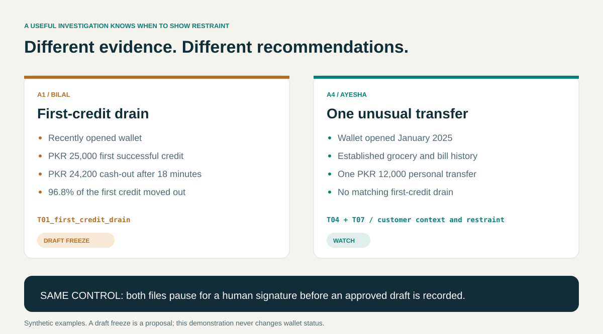

# Six cases, six reasons to investigate

[Documentation](README.md) · [Example packs](examples/README.md) · [Data dictionary](DATA_SOURCES.md)

These fictional cases are designed to test how evidence changes a fintech investigation. A strong pattern should be visible, but so should an innocent explanation, a previous review and a customer-service issue. Every outcome below is a draft requiring a human decision.

## Reading the cases

Amounts are whole PKR. Transaction times are local Pakistan business times. Each investigation stops its evidence window at the alert's opening time, 1 September 2026 at 11:00. A risk hint is an explicit rule result, not a fraud probability. The cited handbook is fictional internal policy written for this demonstration.

| Alert | Main question | Fraud-desk proposal | Key clause |
|---|---|---|---|
| A1 | Was the first credit rapidly drained? | Freeze | T01 |
| A2 | Do failed night payments accompany a later cash-out? | Watch | T02 |
| A3 | Are new wallets sending to the same unfamiliar payee? | Watch | T03 |
| A4 | Is one unusual payment enough to restrict an established customer? | Watch | T04 / T07 |
| A5 | Does a small purchase remove the need to review an active flag? | Close current review; keep flag | T05 |
| A6 | Are two debits a duplicate-payment complaint? | Watch | T06 |

## A1 — Bilal: first credit, then drain

| Evidence | Observation |
|---|---|
| First successful credit | PKR 25,000 on 31 August at 14:00 |
| Following cash-out | PKR 24,200 at 14:18 |
| Elapsed time | 18 minutes |
| Share drained | 24,200 / 25,000 = **96.8%** |

The first-credit query finds the earliest actual successful receipt, rather than treating any recent receipt as the first. It then checks qualifying successful outward movement within 30 minutes. This case exceeds the 80% drain threshold and aligns with [T01](../playbook/T01_first_credit_drain.md).

The fraud desk proposes freeze and receives a high rule-based hint. The care desk proposes watch. Neither desk can approve its own draft. The difference is a desk workflow choice; the transaction evidence remains the same.

The pack leaves source-of-funds and destination verification to the officer. The synthetic pattern is corroboration for investigation, not proof of criminal conduct. A signed watch override preserves both the original freeze proposal and the officer's decision in the audit record.

[Read the evidence pack](examples/A1.md) · [Inspect the JSON](examples/A1.json)

## A2 — Imran: failed bills before cash-out

Six bill attempts fail between 01:00 and 04:20 on 1 September. A successful PKR 18,000 cash-out follows at 05:12, **52 minutes after the last failure**.

The query checks sequence as well as count: cash-out must follow the last failed attempt within two hours. Merely finding failed bills and a withdrawal somewhere in the same week would be weaker evidence. The failed amounts remain attempted payments; they are not added to settled outflow.

[T02](../playbook/T02_night_bill_camouflage.md) supports review of this sequence. The hint is medium and the draft is watch. The officer still needs to establish whether the failed payments reflect a service problem, customer behavior or a suspicious sequence. The rule does not resolve intent.

[Read the evidence pack](examples/A2.md) · [Inspect the JSON](examples/A2.json)

## A3 — Sara and Nadia: a shared unfamiliar payee

| Wallet | Successful transfer on 31 August | Evidence id |
|---|---|---|
| Sara | PKR 9,500 at 16:00 | `txn_sara_payee` |
| Nadia | PKR 9,800 at 16:40 | `txn_nadia_payee` |

Both newly opened wallets send to the same unfamiliar payee within 24 hours. The matching query scopes both sides of the relationship and filters payee categories: two customers paying the same ordinary grocery shop or utility should not create this finding.

LangGraph sends each wallet to the entity investigation subgraph. The resulting memos remain separate, carry their own transaction ids, and are included in `linked_evidence` in the saved pack. This matters for review: the main subject's timeline alone cannot substantiate the counterparty wallet's behavior.

[T03](../playbook/T03_shared_new_payee.md) supports the shared-payee investigation. The recommendation is watch, with linked-wallet review required. The relationship deserves examination, but the fixture does not establish a coordinated fraud network or beneficial ownership of the payee.

[Read both memos in the pack](examples/A3.md) · [Inspect the JSON](examples/A3.json)

## A4 — Ayesha: one unusual transfer in an established account

Ayesha's wallet opened on 15 January 2025. The fixture provides around 30 ordinary grocery and bill transactions across July and August 2026, followed by a PKR 12,000 personal transfer on 31 August at 19:10. The transfer is unusual in that supplied history, but it is not a first-credit drain.

[T04](../playbook/T04_loyal_customer_one_odd.md) and [T07](../playbook/T07_when_not_to_freeze.md) support restraint. The pack proposes watch with a low hint instead of turning a single atypical payment into a freeze recommendation. Both policy references remain attached to the deterministic rationale even if the optional headline writer returns fewer citations.

The account's opening date does not imply that the fixture contains every transaction since opening. The officer should verify the payment's purpose and consider proportionate follow-up. The supplied history supports context, not certainty about the customer's intent.

[Read the evidence pack](examples/A4.md) · [Inspect the JSON](examples/A4.json)

## A5 — Hamza: a small payment with an active watchlist

Hamza has an active watchlist flag and a previously closed review dated 15 August. The current activity is a PKR 400 grocery payment on 1 September at 10:00.

The amount is small, but it does not deactivate the flag or remove the review gate. [T05](../playbook/T05_already_reviewed_watchlist.md) and the prior-review context support closing the current review when no additional adverse evidence is found. The flag remains active. The explicit risk hint is medium because the watchlist condition remains present.

Here, `close` is the proposed review decision. Signing it records an approved draft; this demonstration does not update the alert's status or clear a wallet flag. A real operational closure and watchlist-removal process would need its own authorized workflow.

[Read the evidence pack](examples/A5.md) · [Inspect the JSON](examples/A5.json)

## A6 — Ayesha: duplicate debit and previous goodwill

Two successful merchant debits of PKR 4,500 occur at 11:00 and 11:11 on 31 August. A previous PKR 800 goodwill decision is recorded on 10 August, within the same calendar quarter.

The duplicate query looks for distinct transaction ids at the same merchant, for the same amount, within 15 minutes in the trailing seven-day window. This is a duplicate-payment signal, not two copies of one database row. [T06](../playbook/T06_duplicate_merchant_debit.md) supports investigating a one-leg reversal.

The pack proposes watch, preserves the previous goodwill context and avoids proposing another goodwill payment. It does not execute a reversal, refund or freeze. The officer still needs to confirm merchant and settlement evidence before deciding which debit, if either, should be reversed.

The fraud and care examples use the same financial evidence. The care version leads with a short paragraph and keeps transaction detail expandable, showing how presentation can change without weakening the evidence record. T10 is related care-handbook reading; a pack may only cite it if retrieval actually returns it.

[Fraud pack](examples/A6.md) · [Care pack](examples/A6-care.md) · [Care handbook](../playbook/T10_goodwill_and_care_desk.md)

## What these cases establish

The six cases check several different behaviors: a corroborated pattern can strengthen a recommendation; normal history can limit it; an existing flag survives an innocuous purchase; and a complaint can require remediation analysis without a fraud restriction. All six still reach the same human approval boundary.

These are controlled examples, not an evaluation of real-world fraud detection accuracy. The [validation record](VALIDATION.md) maps the claims to tests, while the [architecture guide](GUIDE.md) explains the controls that preserve evidence through approval.
