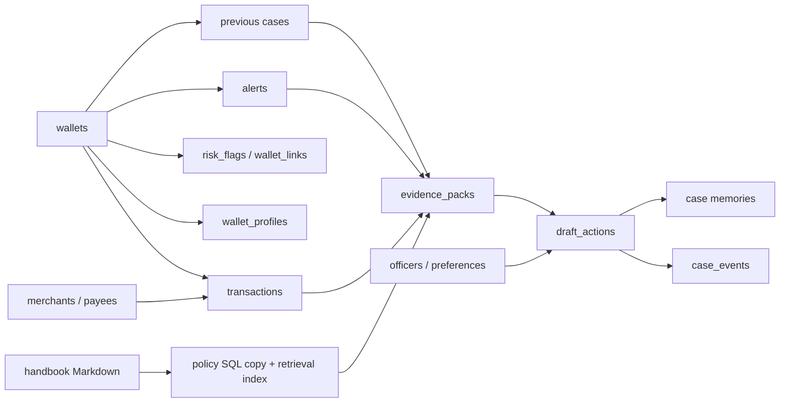

# Data sources and financial assumptions

All records and policies are fictional. The original Word requirements and searchable text extractions are preserved in [specifications](specifications/README.md). Runtime reads checked-in SQL and handbook Markdown, not Word files or external customer systems.

| Source | Authoritative tables or files | Purpose |
|---|---|---|
| `seed_wallets.sql` | wallets, wallet_profiles, officers, officer_prefs | Fictional identities, desk permissions and formatting preferences |
| `seed_merchants.sql` | merchants | Twenty payees and shops; category disambiguates shared-payee evidence |
| `seed_transactions.sql` | transactions | 293 transaction events; statuses distinguish attempts from settled movement |
| `seed_links_flags.sql` | wallet_links, risk_flags | One explicit link and Hamza's active watchlist/prior-review flags |
| `seed_alerts_cases.sql` | alerts, cases | Six alerts and ten prior cases, including approved goodwill |
| `seed_labels.sql` | alert_labels | 100 synthetic rule-tag examples; no real-world ground truth |
| `seed_memories.sql` | memories | Two customer facts and two officer procedure notes |
| `playbook/T01…T10.md` | policy_docs, policy_clauses | Fictional internal policy; SQL stores the exact Markdown audit copy |
| `repos/features.py` | txn_features | Rebuildable feature snapshot; runtime recalculates at the alert cutoff |
| `data/playbook_index/clauses.json` | Whole-page retrieval corpus | Locally generated TF-IDF source index with content checksum |
| Signed workflow | evidence_packs, draft_actions, case_events, memories | Exact pack, approved draft, decision provenance and cross-case context |
| Standalone graph | data/gawah_graph.db | Checkpoints and thread history, separate from operational data |
| Studio runtime | .langgraph_api | Server-managed development checkpoints and Store |

## Core fields

- `transactions.txn_id`: stable event identity. A duplicate-debit finding consists of two distinct ids, not duplicate database rows.
- `amount_pkr`: integer whole rupees. A failed bill amount is an attempted amount, never counted as settled cash movement.
- `direction`: in or out relative to the subject wallet. This fixture is not a complete accounting ledger.
- `txn_ts`: naive Pakistan local business time. ISO `YYYY-MM-DD HH:MM:SS` supports deterministic SQLite filters.
- `status`: success, failed, pending or reversed. Pattern queries require their specified status.
- `risk_flags.active`: current snapshot, not a history of flag changes. Flags cannot be reconstructed at an arbitrary historical instant.
- `draft_actions.status=approved`: an officer accepted this draft. It does not mean a live freeze or transfer was executed.
- `signed_at`: actual UTC review time, independent of the historical evidence cutoff.
- `case_events.detail`: JSON with review id, proposed action, human decision, officer, comment and evidence cutoff.
- `evidence_packs.pack_id`: review id shared with `draft_actions.action_id`; binds approval to the saved pack and prevents duplicate replay.
- `memories.namespace`: profile, cases or procedure; read access is scoped to the subject wallet and selected officer.

## Rebuild and audit

`seeds/generate_sources.py` reproducibly authors the synthetic identity/ledger SQL. `seeds/write_playbook.py` authors the fictional handbook. The checked-in outputs are the normal installation inputs. `seeds/seed_playbook_sql.py` mirrors the handbook with upserts and exports `seed_playbook_sql.sql`.

`seeds/build_db.py` applies the source files in dependency order, mirrors clauses and rebuilds features. Use `--reset` only for disposable demo data. Review history is deliberately not carried into a fresh seed. Tests use isolated temporary databases.

Foreign keys are enabled on every application connection. The proposal's schema is preserved, including its limited foreign-key coverage. Cross-record approval identities are checked in the approval transaction. A production migration would need stronger constraints, migrations, effective-dated identities/flags, access control and a real financial posting model; those are outside the supplied scope.

## How the records connect

The diagram shows logical relationships used by the application. It is not a claim that every edge has a database foreign-key constraint: the supplied schema declares those for wallet profiles and transaction wallet/merchant references.



The full [schema](../seeds/schema.sql) contains 18 tables. Their roles are deliberately separate:

| Group | Tables | Interpretation |
|---|---|---|
| Customer and counterparties | `wallets`, `wallet_profiles`, `merchants` | Synthetic identities and descriptive context |
| Activity and relationships | `transactions`, `wallet_links`, `risk_flags` | Financial events, explicit links and current flags |
| Review workload | `alerts`, `cases` | Current alert subjects and historical case context |
| Policy | `policy_docs`, `policy_clauses` | Exact audit copy of the fictional Markdown handbook |
| Desk configuration | `officers`, `officer_prefs` | Two local demo identities and presentation preferences |
| Derived fixtures | `txn_features`, `alert_labels` | Rebuildable features and synthetic rule tags |
| Review output | `evidence_packs`, `draft_actions`, `case_events`, `memories` | Saved evidence, approved drafts, audit events and reusable context |

## Read-only inspection examples

Open your local operational database in a SQLite client. This query shows the status explicitly, so attempted payments cannot be mistaken for settled movement:

```sql
SELECT txn_id, txn_ts, amount_pkr, direction, txn_type, status
FROM transactions
WHERE wallet_id = 'w_bilal_khi'
  AND txn_ts <= '2026-09-01 11:00:00'
ORDER BY txn_ts, txn_id;
```

After explicitly signing a review, compare the saved proposal with the approved decision:

```sql
SELECT p.pack_id,
       p.alert_id,
       json_extract(p.json_body, '$.recommended_action') AS proposed,
       a.action AS signed_decision,
       a.status,
       a.officer_id,
       a.signed_at
FROM evidence_packs AS p
JOIN draft_actions AS a ON a.action_id = p.pack_id
ORDER BY a.signed_at;
```

Before any signature, the second query has no approved review rows. A signed override can legitimately show `freeze` in `proposed` and `watch` in `signed_decision`. This difference is part of the audit record, not a data inconsistency. SQLite's JSON extraction is used here for inspection; the application also preserves the complete JSON body.

## Time windows and missing history

The alert opening time bounds investigation activity. First-credit drain uses the actual earliest successful receipt and qualifying outward movement within 30 minutes. Shared-payee evidence uses 24 hours; duplicate-debit evidence looks back seven days and compares debits within 15 minutes; prior goodwill is scoped to the calendar quarter. These windows express the planted policy stories, not industry-wide detection thresholds.

Wallet and flag rows are current snapshots. A fixed transaction cutoff does not make them historically versioned. Likewise, a wallet opening date is not evidence that every transaction since opening is present. Timeline and linked-memo presentation are limited to recent rows, while the dedicated repository queries establish each specific pattern.

## Published files versus local state

Checked-in SQL and handbook files are the reproducible inputs. Example JSON/Markdown and the SVG illustrations are published outputs. Operational databases, checkpoints, indexes, `.env`, virtual environments and personal review exports are local artifacts excluded from Git.

`scripts/export_demo.py` creates isolated temporary databases and retrieval data, exports unsigned packs in offline mode, and removes the temporary runtime data when finished. This keeps published examples independent of your saved approvals and remembered case history. Use [the example index](examples/README.md) to compare the structured and readable versions.
