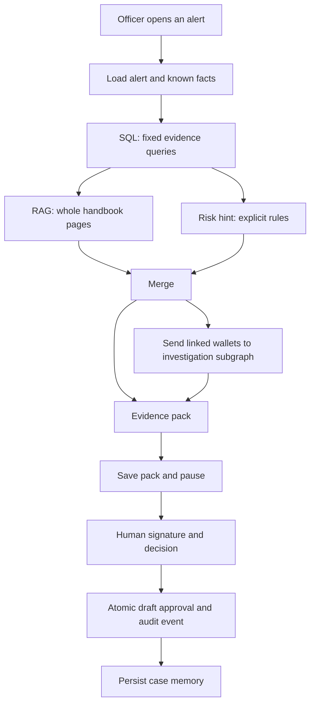

# Implementation guide

Return to the [project overview](../README.md). Run all commands below from the repository root.

> SQL shows what moved. The playbook shows which pattern might apply. LangGraph pauses before recording an approved draft.

Gawah File is a local investigation desk for six fictional digital-wallet alerts. It assembles ledger evidence, retrieves handbook clauses, writes an evidence pack, and stops for an officer's decision. An approved action is a recorded draft: this project does not call a payment network, change wallet balances, execute a reversal, or actually freeze a wallet.

No production wallet data was used. The names, phone placeholders, transactions, flags and handbook rules are synthetic. This is an investigation-workflow demonstration, not a fraud detector, regulatory handbook, authenticated banking system or production AML service.

## Run it on Windows

Use Python 3.11 or later. Run commands from this directory. The checked-in SQL and Markdown are sufficient; no API key is needed.

```powershell
python -m venv .venv
.venv/Scripts/python.exe -m pip install -r requirements.txt
Copy-Item .env.example .env
.venv/Scripts/python.exe seeds/build_db.py
.venv/Scripts/python.exe scripts/check_seeds.py
.venv/Scripts/python.exe scripts/build_index.py
.venv/Scripts/python.exe -m pytest -q -p no:langsmith
.venv/Scripts/python.exe scripts/demo_alert.py A1 --thread first-review
```

On a fresh clone, create the environment and seed the database using the commands above. For an existing setup, start with `scripts/demo_alert.py`, using a new thread name. The builder refuses to overwrite an existing database unless you pass `--reset`. Reset discards operational review history; stop Studio first, and use new thread ids afterward. Tests use their own temporary databases and do not clear your demo.

On Linux/macOS, substitute `.venv/bin/python` and `.venv/bin/langgraph`. `requirements-lock.txt` captures the exact installed versions verified on Windows/Python 3.12; use `requirements.txt` for a portable installation.

## The approval boundary

```powershell
.venv/Scripts/python.exe scripts/demo_alert.py A1 --thread first-review --inspect
.venv/Scripts/python.exe scripts/demo_alert.py A1 --thread first-review --sign watch --comment "Verify the destination before restricting the wallet."
.venv/Scripts/python.exe scripts/demo_alert.py A4 --thread loyal-customer
.venv/Scripts/python.exe scripts/demo_alert.py A6 --desk care --thread duplicate-payment
```

`--sign` is the explicit local officer operation. The ordinary input schema contains only `alert_id` and `officer_id`; a submitted `signed` field cannot preapprove an investigation. The graph pauses before `apply_action` for every alert. Resuming without a true Boolean signature and an allowed decision logs a refusal and returns to that pause. The officer may override the recommendation.

Approval, its audit event and the exact saved pack are checked inside a SQLite write transaction. A repeated review id cannot create duplicate actions or change an existing decision. A changed pack must be investigated again. `signed=True` is a trusted local control field, **not a cryptographic signature or proof of identity**. Anyone with local Python, database or Studio access is inside the demo's trust boundary.

The saved pack is the approval snapshot. The audit event reads the original recommendation from that snapshot and the evidence cutoff from the alert record, rather than trusting duplicate fields in mutable graph state. A human override is recorded separately from the original recommendation. Review identity, alert, wallet and officer are checked before the write.

`draft_actions` and the approval `case_events` entry commit together. Case memory is written afterward and is independently idempotent, so retrying that step cannot create another approval. Replay protection applies to a review id; a separate investigation of the same alert receives a different id. The demonstration does not enforce a one-review-per-alert business rule.

Signing `freeze`, `close` or `file_compliance` records an approved draft only. It does not change wallet status, close an alert, clear flags, send a regulatory filing or post a financial transaction. Extending the project into those operations requires a separate authenticated execution boundary.

## Studio

```powershell
$env:PYTHONUTF8 = '1'
.venv/Scripts/langgraph.exe dev --no-browser --no-reload --port 2024
```

Open [Studio](https://smith.langchain.com/studio/?baseUrl=http://127.0.0.1:2024) or the [local API documentation](http://127.0.0.1:2024/docs). Studio's hosted browser interface may require a LangSmith account. The standalone Python runner works entirely offline. Keep the development server bound to `127.0.0.1`.

Select `gawah_fraud` and submit:

```json
{"alert_id": "A1", "officer_id": "off_fraud_01"}
```

For care, select `gawah_care` and use `off_care_01`. Both graph entries use the same implementation; the officer's SQL desk and preferences determine behavior. Example assistant configurations are in [studio/assistants.json](../studio/assistants.json). Arbitrarily passing a different `desk_role` does not override the officer record.

At the pause, inspect `pack`, `sql_findings`, `policy_hits`, `evidence` and `gate_reason`. Update state with `signed: true`, `human_decision: "watch"` and an optional `human_comment`, then resume. `scripts/smoke_studio.py` creates both configured demo assistants and verifies the whole API workflow with explicitly scripted synthetic signatures.

The standalone runner uses `data/gawah_graph.db`. Agent Server supplies its own checkpointing and Store under `.langgraph_api`; custom SQLite checkpointers and Stores are rejected by the server. In both modes, operational data stays in `data/gawah_ops.db`.

For double-text handling, use `multitask_strategy="interrupt"` for server runs. While waiting for a signature, append an officer message through `update_state(..., as_node="gate")`; do not start another investigation in the same thread. Each new case requires a fresh thread so reducers cannot combine evidence from different alerts.

## The three planes



The generated [graph diagram](graph.mmd) shows the actual LangGraph topology. SQL owns facts and audit records. Retrieval owns handbook matching. LangGraph owns the sequence, linked-wallet fan-out, checkpoint and permission boundary. No model receives a database connection or a free-form SQL tool.


### Follow a case through the code

| Stage | Main implementation | Result and write surface |
|---|---|---|
| Load | `graph/desk.py` | Validates the alert/officer; loads scoped customer and procedure memory; creates a review identity |
| Gather | `graph/gather.py`, `repos/` | Reads bound SQL evidence at the alert cutoff |
| Retrieve / score | `retrieve/retriever.py`, `risk/hint.py` | Parallel policy matches and explicit risk hints; neither can approve an action |
| Merge / route | `graph/desk.py`, `graph/routing.py` | Joins both branches and dispatches linked entities when required |
| Investigate entity | `graph/investigate_entity.py` | Produces one memo per wallet, with findings and transaction ids |
| Write pack | `pack/rules.py`, `pack/writer.py` | Creates a validated pack; retains linked memos in a stable wallet order |
| Gate | `graph/gates.py`, `repos/reviews.py` | Saves the exact pack and pauses before `apply_action` |
| Apply / persist | `graph/gates.py`, `repos/reviews.py` | Validates the local signature and decision; atomically records approval and audit |
| Remember | `graph/memory.py` | Saves an idempotent case memory after approval |

The pack is the portable review artifact. Graph state also contains intermediate query results and retrieved pages, but those should not be needed to recover A3's linked-wallet memos: they are preserved in `linked_evidence`. The Markdown renderer reads the structured pack and adds the current review status supplied by the runner. It does not query the database or choose an action.

Messages and linked-entity evidence use reducers so parallel work can accumulate. Reusing a completed or paused thread to open another alert could mix those accumulated values; the loader and CLI therefore reject a new investigation in an existing thread. Inspect or sign that thread, or start a fresh one.

## The six alerts

| Alert | Evidence | Fraud-desk draft | Required review |
|---|---|---|---|
| A1 / Bilal | PKR 25,000 first credit; PKR 24,200 out 18 minutes later | Freeze | High hint; restricted draft |
| A2 / Imran | Six failed night bills; later PKR 18,000 cash-out | Watch | Human signature |
| A3 / Sara and Nadia | PKR 9,500 and 9,800 to one new payee | Watch | Two entity memos; linked-wallet review |
| A4 / Ayesha | Established history and one PKR 12,000 P2P send | Watch | Restraint; no freeze recommendation |
| A5 / Hamza | Active watchlist, closed prior review, PKR 400 grocery | Close | Watchlist remains; small amount does not bypass review |
| A6 / Ayesha | Two PKR 4,500 shop debits, 11 minutes apart; prior goodwill | Watch | Investigate one-leg reversal; no repeat goodwill |

Care proposes watch on A1. Every alert pauses. See [example evidence packs](examples/README.md) for JSON and Markdown outputs.

## Data and clocks

The seed contains 12 wallets, 20 merchants/payees, 293 transactions, six alerts, ten historical cases, two officers, 100 synthetic label rows and ten handbook clauses. Labels are rule-tagged fixtures, not independent observations suitable for claiming model accuracy.

Amounts are integer **whole PKR**, exactly as specified; this dataset does not represent fractional rupees. Ledger and seed timestamps are naive local Pakistan business times. `GAWAH_AS_OF` fixes the demo clock at `2026-09-01T12:00:00`; investigation queries use the earlier alert opening time (`11:00`) as their upper bound. Features never use a later human decision. Actual approval timestamps are recorded separately in UTC.

`wallets` and `risk_flags` are current snapshots, because the supplied schema has no temporal versions for them. Historical flag reconstruction is therefore outside this demonstration. The ledger is evidence, not a double-entry accounting or balance system. See [the data dictionary](DATA_SOURCES.md).

## Retrieval and model writing

The local index stores one complete clause per chunk. TF-IDF unigram/bigram vectors and cosine similarity keep this ten-page corpus inspectable. A top score below `0.18` produces no hits; individual weaker hits are omitted. With no applicable citation the pack says “No matching typology — escalate” and proposes watch. Similarity is not a probability or legal conclusion.

The deterministic template is the default (`GAWAH_OFFLINE=1`). To try the optional writer, set `GAWAH_OFFLINE=0`, `OPENAI_API_KEY` and `GAWAH_CHAT_MODEL` in your private `.env`. It uses temperature zero, a bounded prompt, a 20-second request timeout and one retry. Missing credentials or a provider error fall back to the template. The model can improve the headline; transaction facts, risk, remembered facts, policy rationale and recommendation remain controlled by the evidence rules. Citation ids and exact quotes are checked against retrieved text.

The live provider path is optional and was not exercised with a paid key. The offline path, missing-key fallback and fabricated-model-output guards are tested. Tracing is off by default.

The writer retains the baseline's complete citation set and exact quotes. A candidate headline cannot remove a clause still referenced by the retained rationale. The headline remains model-generated prose when online mode succeeds; keeping structured facts fixed does not independently verify every assertion that prose could contain. The officer must still review it.

## Risk and memory

The explicit rule path is active. Bilal's 18-minute first-credit timing and 0.968 six-hour out/in ratio produce a high hint. Night bill failures produce medium. An active watchlist alone produces medium and independently forces review. No classifier is trained and no model artifact is required. A high hint can only strengthen the gate.

Store namespaces are `("profile", wallet_id)`, `("cases", wallet_id)` and `("procedure", officer_id)`. SQL mirrors durable memories and hydrates the Store on each load. Ayesha's prior goodwill and Hamza's previous review are seeded. A signed decision adds an idempotent case memory; unsigned attempts do not. Current case memories are review context and never feed risk features.

## LangGraph pieces used

StateGraph, typed state, add_messages and explicit reducers, START/END, parallel retrieval/risk branches, a join, conditional edges, a compiled entity subgraph, Send fan-out, invoke/stream-compatible graphs, SQLite checkpoints, thread ids, get_state/update_state/get_state_history, static interrupts, Store, two assistant configurations and the `interrupt` multitask strategy.

The read-only tool registry is available for inspection. The application uses deterministic repository calls rather than a ReAct loop. There is no model-bound approval tool, free-form SQL, supervisor, swarm, Deep Agents, cloud dependency, React app, FastAPI application or Streamlit interface.

## Deviations from the documents

- **SQL fixes:** the first-credit query selects the actual earliest successful receipt; shared-payee matching scopes both wallet sides and excludes ordinary shared shops/utilities. Time filters include an upper bound. Night cash-out must follow the last failure within two hours. Duplicate searches use the trailing seven-day investigation window.
- **Local vectors:** TF-IDF replaces downloaded dense embeddings and Chroma/FAISS. JSON stores the whole-page index, and vectors rebuild from that small corpus in memory. Changed Markdown requires an index rebuild.
- **One review pause:** a global `interrupt_before=["apply_action"]` enforces all gates. Gate reasons capture watchlist/high-hint/restricted/linked conditions without adding the deprecated `NodeInterrupt` exception and a second resume protocol. The unsigned write guard remains authoritative.
- **Server persistence:** Studio gets its Store/checkpointer from Agent Server; standalone scripts use SqliteSaver and InMemoryStore with a SQL mirror. See [LangGraph persistence](https://docs.langchain.com/oss/python/langgraph/persistence) and [interrupts](https://docs.langchain.com/oss/python/langgraph/interrupts).
- **Review safety:** the existing pack/action primary keys serve as review ids for idempotency. Packs are saved before the pause so the approved snapshot can be compared. No extra tables were introduced. The additional `merge` node joins the independent retrieval and risk branches.
- **Model scope:** wording assistance cannot change a deterministic recommendation. This is stricter than allowing a model to choose an action and filtering it afterward.
- **Optional ML omitted:** the specified rule fallback is active. The repeated synthetic labels do not justify performance claims or a trained risk model.
- **Reset is explicit:** `build_db.py --reset` is required before discarding an existing operational database.

## Checks and demo

```powershell
.venv/Scripts/python.exe -m pytest evals/test_goldens.py -q -p no:langsmith
.venv/Scripts/python.exe scripts/demo_gate.py
.venv/Scripts/python.exe scripts/demo_time_travel.py
.venv/Scripts/python.exe scripts/export_demo.py
```

The golden suite rebuilds data and retrieval for each alert, checks evidence/citations/recommendations, verifies the pause, attempts an unsigned resume and records an explicit scripted signed decision. The wider suite covers SQL injection, cutoff leakage, first-credit semantics, FK enforcement, model guards, memory isolation, tampered packs, replay and thread isolation.

Use [the 90-second demo script](DEMO.md) and [validation notes](VALIDATION.md). A recorded video is not bundled.
